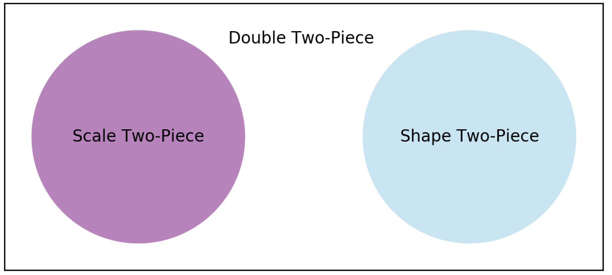

# *twopiece*: Two-Piece Distributions


- **Homepage:** https://github.com/quantgirluk/twopiece
- **Free software:** MIT license

---

<!-- TOC depthFrom:1 depthTo:6 withLinks:1 updateOnSave:1 orderedList:0 -->

- [Overview](#overview)
- [Supported Distributions](#supported-distributions)
- [Main Features](#main-features)
- [Quick Start](#quick-start)
- [Install](#install)
<!-- /TOC -->
---
## Overview

The **_twopiece_** library provides a [Python](https://www.python.org/) implementation of the family of Two Piece distributions. It covers three subfamilies Two-Piece Scale, Two-Piece Shape, and Double Two-Piece.


<figure>
<center>
  <p>
  <figcaption>Two Piece Families</figcaption>
</figure>

---
### Two-Piece Scale

The family of **two–piece scale distributions** is a family of univariate three parameter location-scale models, where **_skewness_** is introduced by differing **_scale_** parameters either side of the mode.

**Definition.** Let  be a unimodal symmetric (about 0) probability density function (pdf) from the [location-scale family](https://en.wikipedia.org/wiki/Location%E2%80%93scale_family), possibly including a shape parameter . Then, the pdf of a member of the two-piece family of distributions is given by

<p align="center"></p>

**Example.** If  corresponds to the normal pdf, then  corresponds to the pdf of the Two-Piece Normal distribution as proposed by [Gustav Fechner](https://en.wikipedia.org/wiki/Gustav_Fechner).

---

### Two-Piece Shape

The family of **two–piece shape distributions** is a family of univariate three parameter location-scale models, where **_skewness_** is introduced by differing **_shape_** parameters either side of the mode.

**Definition.** Let  be a unimodal symmetric (about 0) probability density function (pdf) from the [location-scale family](https://en.wikipedia.org/wiki/Location%E2%80%93scale_family) which includes a [shape parameter](https://en.wikipedia.org/wiki/Shape_parameter) . Then, the pdf of a member of the two-piece family of distributions is given by

<p align="center"></p>
where
<p align="center"></p>


**Example.** If  corresponds to the Student-t pdf, then  corresponds to the pdf of the Two-Piece Shape Student-t distribution. Note that  has different shape parameter on each side mode but the same scale .

---

### Double Two-Piece

The family of **double two–piece distributions** is obtained by using
a density–based transformation of unimodal symmetric continuous distributions with a shape parameter. The resulting distributions contain five interpretable parameters that control the mode, as well as both **scale and shape** in each direction.

**Definition.** Let  be a unimodal symmetric (about 0) probability density function (pdf) from the [location-scale family](https://en.wikipedia.org/wiki/Location%E2%80%93scale_family) which includes a [shape parameter](https://en.wikipedia.org/wiki/Shape_parameter) . Then, the pdf of a member of the two-piece family of distributions is given by

<p align="center"></p>
where
<p align="center"></p>

**Example.** If  corresponds to the Student-t pdf then  corresponds to the pdf of the Double Two-Piece Student-t distribution. Note that  has different scale and shape on each side of the mode.


-------------------------------------------------------------
### References

For technical details on this families of distributions we refer to the following two publications which serve as reference for our implementation.

- [Inference in Two-Piece Location-Scale Models with Jeffreys Priors](https://projecteuclid.org/euclid.ba/1393251764) published in [Bayesian Anal.](https://projecteuclid.org/euclid.ba) Volume 9, Number 1 (2014), 1-22.


- [Bayesian modelling of skewness and kurtosis with Two-Piece Scale and shape distributions](https://projecteuclid.org/euclid.ejs/1440680330)
published in [Electron. J. Statist.](https://projecteuclid.org/euclid.ejs), Volume 9, Number 2 (2015), 1884-1912.

For the [R](https://www.r-project.org/) implementation we refer to the following packages.

- [twopiece, DTP, and TPSAS](https://sites.google.com/site/fjavierrubio67/resources)

---
## Supported Distributions
Implementation is provided for the following distributions.

###  Two-Piece Scale

| Name      |  Function        | Parameters |
|-------------|-------------|----------|
| Two-Piece Normal [[+ info]](https://en.wikipedia.org/wiki/Split_normal_distribution)       | tpnorm       | loc, sigma1, sigma2  |
| Two-Piece Laplace       | tplaplace    |  loc, sigma1, sigma2  |
| Two-Piece Cauchy        | tpcauchy     | loc, sigma1, sigma2  |
| Two-Piece Logistic      | tplogistic   | loc, sigma1, sigma2  |
| Two-Piece Student-t      | tpstudent    | loc, sigma1, sigma2, shape |
| Two-Piece Exponential Power      | tpgennorm    | loc, sigma1, sigma2, shape |
| Two-Piece SinhArcSinh    | tpsas   |loc, sigma1, sigma2, shape |

###  Two-Piece Shape

| Name      |  Function        | Parameters |
|-------------|-------------|----------|
| Two-Piece Student-t      | tpshstudent    | loc, sigma, shape1, shape2 |
| Two-Piece Exponential Power      | tpshgennorm    | loc, sigma, shape1, shape2 |
| Two-Piece SinhArcSinh    | tpshsas   |loc, sigma, shape1, shape2 |


### Double Two-Piece

| Name      |  Function        | Parameters |
|-------------|-------------|-------------|
| Double Two-Piece Student-t      | dtpstudent | loc, sigma1, sigma2, shape1, shape2 |
| Double Two-Piece Exponential Power      | dtpgennorm    | loc, sigma1, sigma2, shape1, shape2 |
| Double Two-Piece SinhArcSinh    | dtpsinhasinh   | loc, sigma1, sigma2, shape1, shape2 |


---
## Main Features
We provide the following functionality

| Function    |  Method   | Parameters |
|-------------|-------------|-------------|
Probability Density Function | pdf | x
Cumulative Distribution Function | cdf |  x
Quantile Function | ppf | q
Random Sample Generation | random_sample | size

for all the supported distributions.

---
## Quick Start

To illustrate usage of the features for the 3 and 4 parameters distributions we will use
the two-piece normal, and two-piece t, respectively. The behaviour is analogous for the rest of the supported distributions.

``` python
from twopiece.single import *
```


#### 1. Create a twopiece instance
To create an instance we need to specify either 3 or 4 parameters:

For the **two-piece normal** we require:

- *loc*: which is the location parameter
- *sigma1*, *sigma2* : which are both scale parameters

```python
loc=0.0
sigma1=1.0
sigma2=1.0
dist = tpnorm(loc=loc, sigma1=sigma1, sigma2=sigma2)
```

For the **two-piece t** we require:

- *loc*: which is the location parameter
- *sigma1*, *sigma2* : which are both scale parameters
- *shape* : which defines the degrees of freedom for the t-Student distribution

```python
loc=0.0
sigma1=1.0
sigma2=1.0
shape=3.0
dist = tpstudent(loc=loc, sigma1=sigma1, sigma2=sigma2, shape=shape)
```

Hereafter we assume that there is a twopiece instance called *dist*.

#### 2. Evaluate and visualise the probability density function (pdf)
We can evaluate the pdf on a single point or an array type object

```python
dist.pdf(0)
```

```python
dist.pdf([0.0,0.25,0.5])
```

To visualise the pdf use
```python
x = arange(-12, 12, 0.1)
y = dist.pdf(x)
plt.plot(x, y)
plt.show()
```

#### 3. Evaluate the cumulative distribution function (cdf)
We can evaluate the cdf on a single point or an array type object
```python
dist.cdf(0)
```

```python
dist.cdf([0.0,0.25,0.5])
```

To visualise the cdf use

```python
x = arange(-12, 12, 0.1)
y = dist.cdf(x)
plt.plot(x, y)
plt.show()
```

#### 4. Evaluate the quantile function (ppf)
We can evaluate the ppf on a single point or an array type object. Note that the ppf has support on [0,1].
```python
dist.ppf(0.95)
```

```python
dist.ppf([0.5, 0.9, 0.95])
```

To visualise the ppf use
```python
x = arange(0.001, 0.999, 0.01)
y = dist.ppf(x)
plt.plot(x, y)
plt.show()
```

#### 5. Generate a random sample

To generate a random sample we require:
- *size*: which is simply the size of the sample

```python
sample = dist.random_sample(size = 100)
```

## Install

#### Requirements
**_twopiece_** has been developed and tested on [Python 3.6, and 3.7](https://www.python.org/downloads/)


```
pip install twopiece
```
