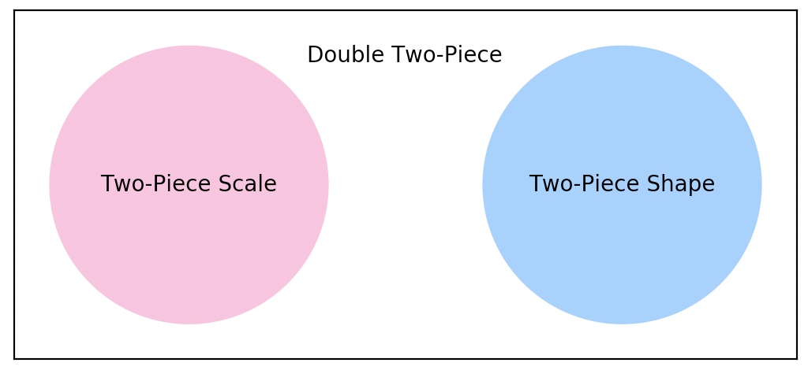

# *twopiece*: Two-Piece Distributions


- Homepage: https://github.com/quantgirluk/twopiece
- Pip Repository: [twopiece](https://pypi.org/project/twopiece/)
- Demo: [Python Notebook](https://github.com/quantgirluk/twopiece/blob/master/twopiece_demo.ipynb)
- Demo: [Interactive](https://mybinder.org/v2/gh/quantgirluk/Quant-Girl-Blog/65feeb57f817cd6df74390121a64d5cf24f7869d?filepath=Twopiece_Demo.ipynb)
- Free software: MIT license

---

<!-- TOC depthFrom:1 depthTo:6 withLinks:1 updateOnSave:1 orderedList:0 -->

- [Overview](#overview)
- [Supported Distributions](#supported-distributions)
- [Main Features](#main-features)
- [Quick Start](#quick-start)
- [Install](#install)
<!-- /TOC -->
---
## Overview

The **_twopiece_** library provides a [Python](https://www.python.org/) implementation of the family of Two Piece 
distributions. It covers three subfamilies [Two-Piece Scale](#two-piece-scale), [Two-Piece Shape](#two-piece-shape), 
and [Double Two-Piece](#double-two-piece). The following diagram shows how these families relate.


<figure>
<center>
  <p>
</figure>

---
### Two-Piece Scale

The family of **two–piece scale distributions** is a family of univariate three parameter location-scale models, 
where **_skewness_** is introduced by differing [**_scale_**](https://en.wikipedia.org/wiki/Scale_parameter) 
parameters either side of the [mode](<https://en.wikipedia.org/wiki/Mode_(statistics)>).

**Definition.** Let $f: \mathbb{R} \mapsto \mathbb{R}_{+}$ be a unimodal symmetric (around zero) probability 
density function (pdf) from the [location-scale family](https://en.wikipedia.org/wiki/Location%E2%80%93scale_family), 
possibly including a [shape parameter](https://en.wikipedia.org/wiki/Shape_parameter) $\delta$. Then, the 
pdf of a member of the two-piece family of distributions is given by

$$
s\left(x; \mu,\sigma_1,\sigma_2, \delta\right) =
  \begin{cases}
\dfrac{2}{\sigma_1+\sigma_2}f\left(\dfrac{x-\mu}{\sigma_1};\delta\right), \mbox{if } x < \mu, \\
\dfrac{2}{\sigma_1+\sigma_2}f\left(\dfrac{x-\mu}{\sigma_2};\delta\right), \mbox{if } x \geq \mu. \\
\end{cases}
$$

**Example.** If $f$ corresponds to the normal pdf, then $s$ corresponds to the pdf of the 
[Two-Piece Normal](https://quantgirl.blog/two-piece-normal/) distribution
  as proposed by [Gustav Fechner](https://en.wikipedia.org/wiki/Gustav_Fechner) in 1887.

---

### Two-Piece Shape

The family of **two–piece shape distributions** is a family of univariate three parameter location-scale 
models, where **_skewness_** is introduced by differing **_shape_** parameters either side of the mode.

**Definition.** Let $f: \mathbb{R} \mapsto \mathbb{R}_{+}$ be a unimodal symmetric (around 0) probability 
density function (pdf) from the [location-scale family](https://en.wikipedia.org/wiki/Location%E2%80%93scale_family) 
which includes a [shape parameter](https://en.wikipedia.org/wiki/Shape_parameter) $\delta$. Then, the pdf of a member 
of the two-piece family of distributions is given by

$$
s\left(x; \mu,\sigma,\delta_1 \delta_2\right) =
  \begin{cases}
\dfrac{2\epsilon}{\sigma}f\left(\dfrac{x-\mu}{\sigma};\delta_1\right), \mbox{if } x < \mu, \\
\dfrac{2(1 -\epsilon)}{\sigma}f\left(\dfrac{x-\mu}{\sigma};\delta_2\right), \mbox{if } x \geq \mu. \\
\end{cases}
$$
where
$$
\epsilon = \dfrac{f(0;\delta_2)}{f(0;\delta_1)+f(0;\delta_2)}.
$$


**Example.** If $f$ corresponds to the Student-t pdf, then $s$ corresponds to the pdf of the 
Two-Piece Shape Student-t distribution. Note that $s$ has different shape parameter on each side mode but 
the same scale.

---

### Double Two-Piece

The family of **double two–piece distributions** is obtained by using
a density–based transformation of unimodal symmetric continuous distributions with a shape parameter. The 
resulting distributions contain five interpretable parameters that control the mode, as well as both **scale 
and shape** in each direction.

**Definition.** Let $f: \mathbb{R} \mapsto \mathbb{R}_{+}$ be a unimodal symmetric (around 0) probability density function (pdf) from the [location-scale family](https://en.wikipedia.org/wiki/Location%E2%80%93scale_family) which includes a [shape parameter](https://en.wikipedia.org/wiki/Shape_parameter) $\delta$. Then, the pdf of a member of the two-piece family of distributions is given by

$$
s\left(x; \mu,\sigma_1,\sigma_2, \delta_1, \delta_2 \right) =
  \begin{cases}
\dfrac{2\epsilon}{\sigma_1}f\left(\dfrac{x-\mu}{\sigma};\delta_1\right), \mbox{if } x < \mu, \\
\dfrac{2(1 -\epsilon)}{\sigma_2}f\left(\dfrac{x-\mu}{\sigma};\delta_2\right), \mbox{if } x \geq \mu. \\
\end{cases}
$$
where
$$
\epsilon = \dfrac{\sigma_1f(0;\delta_2)}{\sigma_2f(0;\delta_1)+\sigma_1 f(0;\delta_2)}.
$$

**Example.** If $f$ corresponds to the Student-t pdf then $s$ corresponds to the pdf of the Double Two-Piece Student-t distribution. Note that $s$ has different scale and shape on each side of the mode.


-------------------------------------------------------------
### Notes

For technical details on this families of distributions we refer to the following two publications which serve as reference for our implementation.

- [Inference in Two-Piece Location-Scale Models with Jeffreys Priors](https://projecteuclid.org/euclid.ba/1393251764) published in [Bayesian Anal.](https://projecteuclid.org/euclid.ba) Volume 9, Number 1 (2014), 1-22.


- [Bayesian modelling of skewness and kurtosis with Two-Piece Scale and shape distributions](https://projecteuclid.org/euclid.ejs/1440680330)
published in [Electron. J. Statist.](https://projecteuclid.org/euclid.ejs), Volume 9, Number 2 (2015), 1884-1912.

For the [R](https://www.r-project.org/) implementation we refer to the following packages.

- [twopiece, DTP, and TPSAS](https://sites.google.com/site/fjavierrubio67/resources)


_twopiece_ has been developed and tested on [Python 3.6, and 3.7](https://www.python.org/downloads/). 


---
## Supported Distributions
Implementation is provided for the following distributions.

###  Two-Piece Scale

| Name      |  Function        | Parameters |
|-------------|-------------|----------|
| [Two-Piece Normal](https://quantgirl.blog/two-piece-normal/)       | tpnorm       | loc, sigma1, sigma2  |
| Two-Piece Laplace       | tplaplace    |  loc, sigma1, sigma2  |
| Two-Piece Cauchy        | tpcauchy     | loc, sigma1, sigma2  |
| Two-Piece Logistic      | tplogistic   | loc, sigma1, sigma2  |
| Two-Piece Student-t      | tpstudent    | loc, sigma1, sigma2, shape |
| Two-Piece Exponential Power      | tpgennorm    | loc, sigma1, sigma2, shape |
| Two-Piece SinhArcSinh    | tpsas   |loc, sigma1, sigma2, shape |

###  Two-Piece Shape

| Name      |  Function        | Parameters |
|-------------|-------------|----------|
| Two-Piece-Shape Student-t      | tpshastudent    | loc, sigma, shape1, shape2 |
| Two-Piece-Shape Exponential Power      | tpshagennorm    | loc, sigma, shape1, shape2 |
| Two-Piece-Shape SinhArcSinh    | tpshasas   |loc, sigma, shape1, shape2 |


### Double Two-Piece

| Name      |  Function        | Parameters |
|-------------|-------------|-------------|
| Double Two-Piece Student-t      | dtpstudent | loc, sigma1, sigma2, shape1, shape2 |
| Double Two-Piece Exponential Power      | dtpgennorm    | loc, sigma1, sigma2, shape1, shape2 |
| Double Two-Piece SinhArcSinh    | dtpsinhasinh   | loc, sigma1, sigma2, shape1, shape2 |


---
## Main Features
We provide the following functionality for all the supported distributions.

| Function    |  Method   | Parameters |
|-------------|-------------|-------------|
Probability Density Function | pdf | x
Cumulative Distribution Function | cdf |  x
Quantile Function | ppf | q
Random Sample Generation | random_sample | size


---
## Quick Start


#### Install

We recommend install _twopiece_ using [pip](https://pip.pypa.io/en/stable/) as follows.


```
pip install twopiece
```

To illustrate usage two-piece scale distributions we will use
the two-piece Normal, and two-piece Student-t. The behaviour is analogous for the rest of 
the supported distributions.

---

#### 1. Create a twopiece instance

First, we load the family (scale, shape and double) of two-piece distributions that we want to use. 

``` python
from twopiece.scale import *
from twopiece.shape import *
from twopiece.double import *
```

To create an instance we need to specify either 3, 4, or 5 parameters:

For the **Two-Piece Normal** we require:

- *loc*: which is the location parameter
- *sigma1*, *sigma2* : which are both scale parameters

```python
loc=0.0
sigma1=1.0
sigma2=1.0
dist = tpnorm(loc=loc, sigma1=sigma1, sigma2=sigma2)
```

For the **Two-Piece Student-t** we require:

- *loc*: which is the location parameter
- *sigma1*, *sigma2* : which are both scale parameters
- *shape* : which defines the degrees of freedom for the t-Student distribution

```python
loc=0.0
sigma1=1.0
sigma2=2.0
shape=3.0
dist = tpstudent(loc=loc, sigma1=sigma1, sigma2=sigma2, shape=shape)
```


For the **Double Two-Piece Student-t** we require:

- *loc*: which is the location parameter
- *sigma1, sigma2* : which are both scale parameters
- *shape1, shape2* : which define the degrees of freedom for the t-Student distribution on each side of
the mode.

```python
loc=0.0
sigma1=1.0
sigma2=2.0
shape1=3.0
shape2=10.0
dist = dtpstudent(loc=loc, sigma1=sigma1, sigma2=sigma2, shape1=shape1, shape2=shape2)
```

Hereafter we assume that there is a twopiece instance called *dist*.


#### 2. Evaluate and visualise the probability density function (pdf)
We can evaluate the pdf on a single point or an array type object

```python
dist.pdf(0)
```

```python
dist.pdf([0.0,0.25,0.5])
```

To visualise the pdf use
```python
x = arange(-12, 12, 0.1)
y = dist.pdf(x)
plt.plot(x, y)
plt.show()
```

#### 3. Evaluate the cumulative distribution function (cdf)
We can evaluate the cdf on a single point or an array type object
```python
dist.cdf(0)
```

```python
dist.cdf([0.0,0.25,0.5])
```

To visualise the cdf use

```python
x = arange(-12, 12, 0.1)
y = dist.cdf(x)
plt.plot(x, y)
plt.show()
```

#### 4. Evaluate the quantile function (ppf)
We can evaluate the ppf on a single point or an array type object. Note that the ppf has support on [0,1].
```python
dist.ppf(0.95)
```

```python
dist.ppf([0.5, 0.9, 0.95])
```

To visualise the ppf use
```python
x = arange(0.001, 0.999, 0.01)
y = dist.ppf(x)
plt.plot(x, y)
plt.show()
```

#### 5. Generate a random sample

To generate a random sample we require:
- *size*: which is simply the size of the sample

```python
sample = dist.random_sample(size = 100)
```

---


